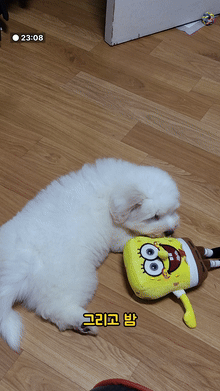
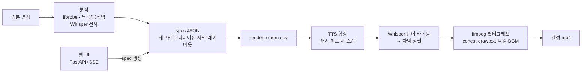
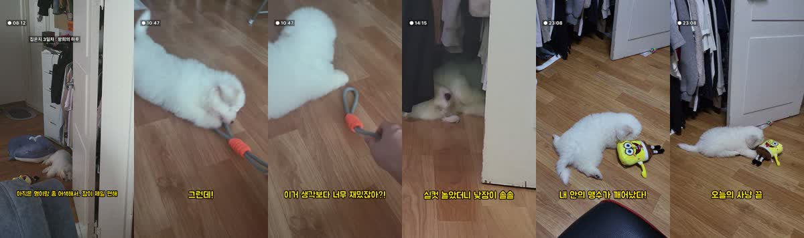
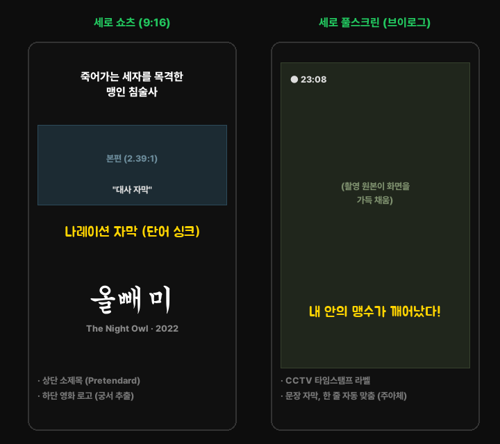

# 캡컷 에이전트 (CapCut Agent)

**유튜브 쇼츠 자동 편집 파이프라인** — 원본 영상과 스토리(spec JSON)만 주면
컷 편집 · TTS 나레이션 · 자막 자동 싱크 · BGM 믹싱 · 렌더링까지 자동으로 완성합니다.

실제 운영 중인 유튜브 채널 2개(반려견 브이로그, 영화 리뷰 쇼츠)의 영상이 이 파이프라인으로 제작되고 있습니다.

<p align="center"></p>

## ✨ 핵심 기능

| 기능 | 구현 |
|---|---|
| **나레이션 자동 자막 싱크** | Whisper 단어 타임스탬프 → 스크립트 문자 비례 정렬. 문장/구 단위 분할, 화면 폭 맞춤 크기 자동 조정, 겹침 방지 | 
| **피사체 추적 크롭** | 프레임차 무게중심으로 움직이는 피사체(강아지)를 추적 → ffmpeg crop 시간함수 식 자동 생성 |
| **TTS 3종 + 캐싱** | Typecast API · edge-tts · Windows SAPI 폴백. `(음성|속도|피치|문구)` 해시 캐시로 바뀐 문장만 재합성 (API 비용 최소화) |
| **오디오 지능** | 사이드체인 덕킹(나레이션 시 원본/BGM 자동 dip), RMS+스펙트럼 평탄도로 동물 발성 감지, 무음 구간 자동 컷 |
| **3종 레이아웃** | 세로 쇼츠(검은 캔버스+로고), 가로 16:9 롱폼, 세로 촬영 풀스크린 — spec 한 줄로 전환 |
| **웹 UI** | FastAPI + SSE — 드래그&드롭 업로드 → 세그먼트/나레이션 편집 → 실시간 진행 스테퍼 → 미리보기 |

## 🏗 아키텍처



## 🎬 결과물 스타일

**반려견 브이로그** — 관찰카메라 컨셉, 1인칭 나레이션, 문장 자막(한 줄 자동 맞춤):



**영화 리뷰 쇼츠 · 브이로그 레이아웃** (모식도 — 실제 렌더는 spec 한 줄로 전환):



## 🚀 실행

요구사항: Windows, Python 3.11+, ffmpeg (`winget install Gyan.FFmpeg`)

```powershell
python -m venv .venv
.venv\Scripts\pip install pycapcut faster-whisper edge-tts fonttools fastapi "uvicorn[standard]" python-multipart

# 웹 UI
.venv\Scripts\python.exe -m uvicorn web.server:app --port 8765 --app-dir .
# → http://localhost:8765

# CLI
.venv\Scripts\python.exe render_cinema.py --spec my_video.json

# 테스트
.venv\Scripts\python.exe -m pytest tests/
```

spec JSON 예시:

```json
{
  "video": "clip.mp4",
  "src_portrait": true,
  "voice": "ko-KR-SunHiNeural",
  "narr_captions": true,
  "caption_mode": "sentence",
  "bgm": {"vol": 0.15},
  "segs": [["clip.mp4", 0.5, 5.5], ["clip.mp4", 8.0, 12.0, 0.5]],
  "narrs": [[0.4, "첫 나레이션입니다."], [6.0, "슬로우 구간 위 나레이션."]]
}
```

Typecast API 키는 `.secrets/typecast.key`에 저장 (커밋 제외).

## 📁 구조

```
render_cinema.py   메인 렌더러 (spec → mp4)
render_cute.py     반려동물 모드 (움직임 이벤트 효과음, 하이라이트 슬로우+줌)
build_master.py    멀티클립 → 피사체 추적 세로 마스터
app/               TTS·전사·오디오 분석·효과음 합성 모듈
web/               로컬 웹 UI (FastAPI + SSE)
library/           폰트(Pretendard·주아·궁서) · 합성 BGM/효과음
examples/          실전 세션 스크립트 아카이브 (레시피)
tools/             프레임 몽타주 등 검증 유틸
tests/             자막 분할·정렬, 추적 crop 식 단위 테스트
cinema_story.md    영화 짤 기승전결 알고리즘 (스토리 설계 절차)
```

에이전트 운영 문서(CLAUDE.md)와 채널 운영 세부는 로컬 전용으로 관리합니다.

## 🧗 실전에서 배운 것들

- **쇼츠 정책**: 60초 초과 + Content ID 주장 = 자동 차단 → 영화 클립 쇼츠는 59초 컷 별도 생성
- **Windows 한글 경로**: PowerShell↔ffmpeg 경계에서 인코딩 깨짐 → 입력은 ASCII 복사, 파라미터는 UTF-8 spec JSON으로 우회
- **BGM 마스킹**: 오르골 BGM이 강아지 울음과 같은 음역 → 단순 볼륨 다운(0.3)으론 부족, 발성 구간 0.05 덕킹 + 3배 부스트
- **발성 감지**: 단순 RMS는 부스럭 잡음을 오인 → 250-3000Hz 대역 RMS + 스펙트럼 평탄도(tonal) 조합으로 판정
- **폰트 함정**: 주아체에 U+2026(…) 글리프 없음 → 자막에서 자동 제거 / 궁서체는 batang.ttc에 묶여 있어 fonttools로 추출

---

## English Summary

**CapCut Agent** is a YouTube Shorts auto-editing pipeline built with Python + ffmpeg.
Feed it source clips and a story spec (JSON); it handles cutting, TTS narration
(Typecast API / edge-tts with hash-based caching), **word-level caption sync via Whisper
timestamps**, motion-based **subject-tracking crop** (frame-diff centroid → ffmpeg
time-expression), sidechain audio ducking, BGM mixing, and multi-layout rendering
(vertical Shorts / 16:9 long-form / full-screen portrait). Includes a local FastAPI + SSE
web UI for drag-and-drop editing. Videos produced by this pipeline run on two live
YouTube channels.
